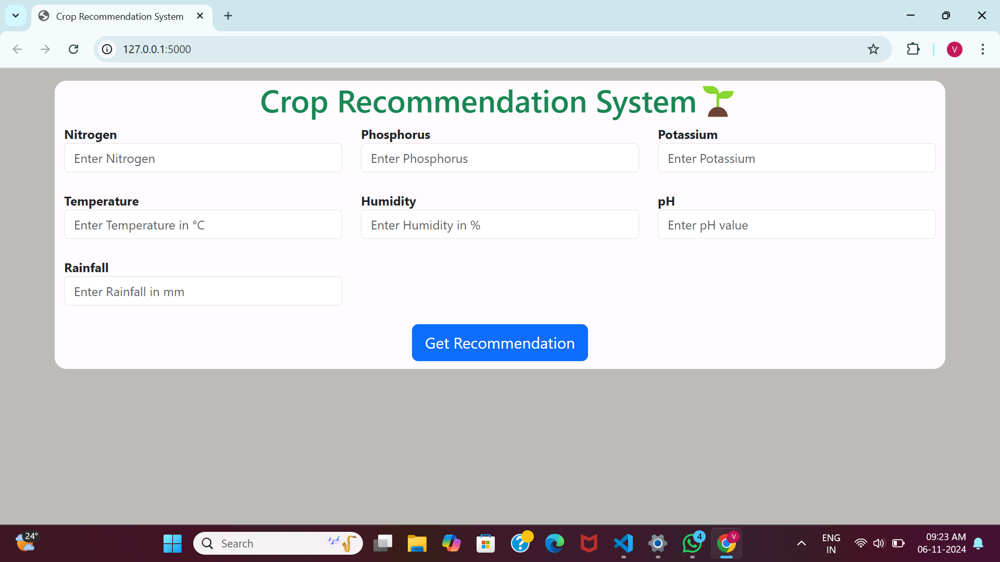

# Crop Recommendation System - Machine Learning Project

This project leverages machine learning to recommend optimal crops based on soil and climate data, providing actionable insights to support agricultural decisions.

## Key Highlights
- **Soil and Climate Analysis**: Assesses critical factors such as Nitrogen, Phosphorus, Potassium, temperature, humidity, and pH levels.
- **Predictive Crop Recommendations**: Trained machine learning model suggests crops with the highest likelihood of success under given conditions.
- **User-Friendly Web Application**: Developed using Flask to offer a simple, interactive interface for users to input environmental data and receive crop recommendations.

## Screenshots

## Usage
On the main page, you will be prompted to input the following information about the field:
- **Soil Type**
- **Temperature**
- **Humidity**
- **Rainfall**
  
After entering the details, click on the "Get Recommendation" button.
The system will return the most suitable crops for the provided conditions.

## Technologies and Algorithms Used

### Technologies:
- **Machine Learning**: scikit-learn for model training and prediction.
- **Data Processing**: Python libraries such as NumPy and Pandas for data handling and preparation.
- **Web Technologies**: 
  - **Frontend**: HTML for structuring the web pages.
  - **Backend**: Flask for building the web application and handling requests.
  - **CSS**: Used for styling the web pages and making the interface user-friendly.

### Algorithms:
- **Decision Tree Classifier**: Used for classification based on various environmental factors (e.g., soil composition, temperature, humidity).
- **Random Forest Classifier**: An ensemble learning method that improves prediction accuracy by combining multiple decision trees.

